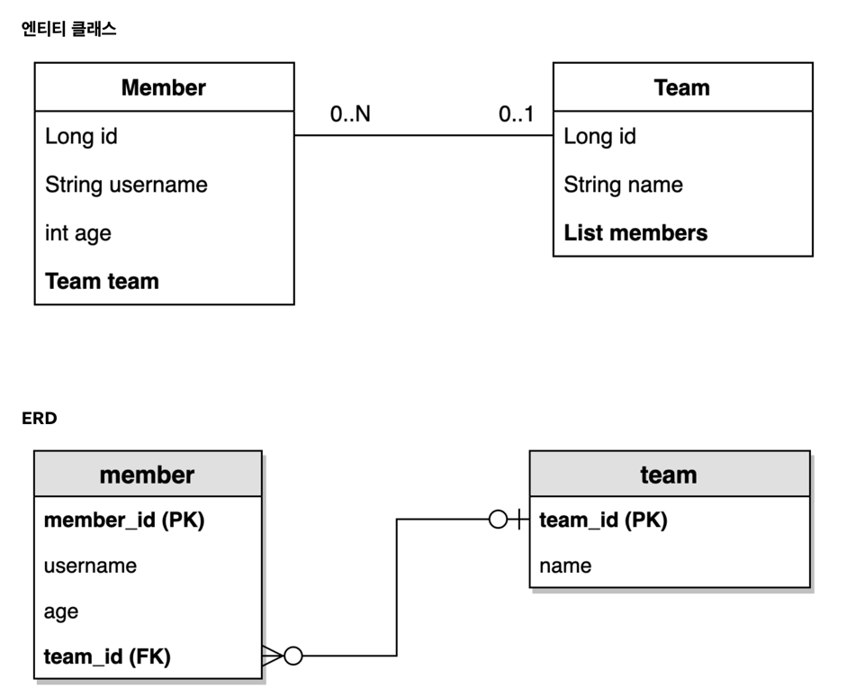

# 7장

### 엔티티 클래스

- member -> team
  - 다대일 관계
  - [Member 연관관계 설정 코드](https://github.com/sseen2/data-jpa-study/blob/796357c93eeb4c0ad0f57160e7f612bb5e11ebee/src/main/java/study/data_jpa/entity/Member.java#L33-L35)
- team -> member
  - 일대다 관계
  - [Team 연관관계 설정 코드](https://github.com/sseen2/data-jpa-study/blob/796357c93eeb4c0ad0f57160e7f612bb5e11ebee/src/main/java/study/data_jpa/entity/Team.java#L28-L29)


```java
public class Member {
    // ...
    
    @ManyToOne(fetch = FetchType.LAZY)
    @JoinColumn(name = "team_id")
    private Team team;
}

public class Team {
    // ...
    
    @OneToMany(mappedBy = "team")
    private List<Member> members = new ArrayList<>();
}
```
- fk가 없는 쪽에 `mappedBy`를 적어주는 것이 좋음


- `@ToString` 어노테이션에 연관관계인 필드를 넣지말 것
  - 연관관계를 타고 가서 출력하기 때문에 양쪽 다 연관관계 필드를 넣었을 경우 무한루프가 될 수 있음


#### 연관관계 세팅 메서드
```java
public class Member {
    // ...
    
    public void changeTeam(Team team) {
        this.team = team;
        team.getMembers().add(this);
    }
}
```
- Member는 Team을 변경할 수 있기 때문에 `changeTeam`을 정의해서 변경할 수 있도록 함
  - team에 있는 member도 변경되도록 세팅

### 지연로딩
- JPA에서 모든 연관관계는 **지연로딩(FetchType.LAZY)**으로 세팅해줘야 함
  -> 즉시로딩을 사용한다면 성능 최적화하기 어려움
- Member를 조회할 때 Member 객체만 가지고 있고 Team은 가짜 객체(프록시 객체)를 가지고 있음
  - Team의 실제 값을 확인하려할 때, Team을 조회해서 정보를 가져옴